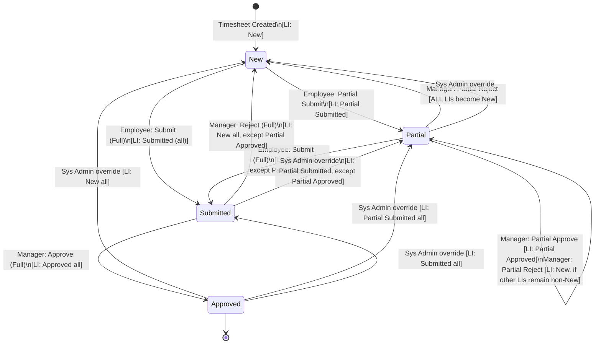

# Timesheet Partial Submit — Architecture & Implementation Record

> **Status:** ✅ Fully Implemented & Deployed to `dbt_partial_test`
> **Last Updated:** 2026-07-30
> **Reference:** [`StatusLogic.md`](file:///G:/Temp_data/SF-TimeSheet/StatusLogic.md)

---

## 1. State Machine — Data Model & Allowed Values

Per `StatusLogic.md`, the state machine is defined as follows:

### Timesheet (`Timesheet__c`) Statuses
| Value | Description |
|---|---|
| `New` | Default state — no submissions yet |
| `Partial` | One or more line items submitted/approved, others still New |
| `Submitted` | Employee submitted the full timesheet |
| `Approved` | Manager fully approved the timesheet |

### Line Item (`Timesheet_Line_Item__c`) Statuses
| Value | Description |
|---|---|
| `New` | Default — editable by employee |
| `Partial Submitted` | Employee partial-submitted this line item |
| `Partial Approved` | Manager approved this individual line item |
| `Submitted` | Part of a full submission |
| `Approved` | Fully approved |

> **Note:** `Partial New`, `Partial Rejected`, and `Partial_Status__c` (dependent picklist on Timesheet) have been **removed** from the data model entirely. They are not part of the StatusLogic specification.

---

## 2. State Transition Diagram



---

## 3. Invariants (Golden Rules)

| Timesheet Status | Required Line Item Statuses |
|---|---|
| `New` | ALL line items = `New` |
| `Partial` | Mix of `Partial Submitted` and/or `Partial Approved` (and possibly `New`) |
| `Submitted` | All = `Submitted`, **except** `Partial Approved` items which retain their status |
| `Approved` | ALL line items = `Approved` |

---

## 4. Complete State Transition Rules (Source of Truth)

| Actor | Operation | Pre-condition | Timesheet Result | Line Item Result |
|---|---|---|---|---|
| Employee | **Partial Submit** | `New` | `Partial` | Selected LIs → `Partial Submitted` |
| Employee | **Submit (Full)** | `New` or `Partial` | `Submitted` | All LIs → `Submitted` **except** `Partial Approved` |
| Manager | **Partial Approve** | `Partial` | `Partial` (unchanged) | Selected LIs → `Partial Approved` |
| Manager | **Partial Reject** | `Partial` | `New` if all LIs are now `New`; else `Partial` | Selected LIs → `New` |
| Manager | **Approve (Full)** | `Submitted` | `Approved` | All LIs → `Approved` |
| Manager | **Reject (Full)** | `Submitted` | `New` | All LIs → `New` **except** `Partial Approved` |
| Sys Admin | **Partial → New** | `Partial` | `New` | ALL LIs → `New` |
| Sys Admin | **Submitted → New** | `Submitted` | `New` | All LIs → `New` **except** `Partial Approved` |
| Sys Admin | **Approved → New** | `Approved` | `New` | ALL LIs → `New` |
| Sys Admin | **Approved → Submitted** | `Approved` | `Submitted` | ALL LIs → `Submitted` |
| Sys Admin | **Submitted → Partial** | `Submitted` | `Partial` | All LIs → `Partial Submitted` **except** `Partial Approved` |
| Sys Admin | **Approved → Partial** | `Approved` | `Partial` | ALL LIs → `Partial Submitted` |

---

## 5. Schema & Metadata Changes

### 5.1 `Timesheet_Default_Value__mdt` (Custom Metadata)
- **Added**: `Allow_Partial_Submit__c` (Checkbox, default `false`)
- Admins can toggle to enable/disable partial submit org-wide.
- File: [`Allow_Partial_Submit__c.field-meta.xml`](file:///G:/Temp_data/SF-TimeSheet/Timesheet/main/default/objects/Timesheet_Default_Value__mdt/fields/Allow_Partial_Submit__c.field-meta.xml)

### 5.2 `Timesheet__c` Fields
- **Modified**: [`Status__c.field-meta.xml`](file:///G:/Temp_data/SF-TimeSheet/Timesheet/main/default/objects/Timesheet__c/fields/Status__c.field-meta.xml) — added `Partial` picklist value.
- **Removed**: `Partial_Status__c.field-meta.xml` — dependent picklist completely removed (not in StatusLogic spec).
- **Updated**: [`Prevent_Insufficient_Absence_Hours.validationRule-meta.xml`](file:///G:/Temp_data/SF-TimeSheet/Timesheet/main/default/objects/Timesheet__c/validationRules/Prevent_Insufficient_Absence_Hours.validationRule-meta.xml) — removed `Partial_Status__c` check, now validates on `Submitted`, `Approved`, or `Partial` status directly.

### 5.3 `Timesheet_Line_Item__c` Fields
- **Added**: [`Line_Item_Status__c.field-meta.xml`](file:///G:/Temp_data/SF-TimeSheet/Timesheet/main/default/objects/Timesheet_Line_Item__c/fields/Line_Item_Status__c.field-meta.xml) — picklist with values: `New`, `Partial Submitted`, `Partial Approved`, `Submitted`, `Approved`.
- **Added**: [`Rejection_Notes__c.field-meta.xml`](file:///G:/Temp_data/SF-TimeSheet/Timesheet/main/default/objects/Timesheet_Line_Item__c/fields/Rejection_Notes__c.field-meta.xml) — manager rejection comments.

---

## 6. Implemented Code — File by File

### 6.1 [`WeeklyTimesheetController.cls`](file:///G:/Temp_data/SF-TimeSheet/Timesheet/main/default/classes/WeeklyTimesheetController.cls) — Employee Actions

#### `isPartialSubmitAllowed()` ✅
Reads `Timesheet_Default_Value__mdt.Allow_Partial_Submit__c` to gate the partial submit feature.

#### `submitPartialLineItems(Id timesheetId, List<Id> lineItemIds)` ✅
- **Pre-condition:** Timesheet must be `New`.
- Updates selected line items → `Partial Submitted`.
- Updates parent Timesheet → `Partial`.
- Uses `Security.stripInaccessible` for FLS enforcement.

```apex
for (Timesheet_Line_Item__c li : itemsToUpdate) {
    li.Line_Item_Status__c = 'Partial Submitted'; // ✅ Correct per StatusLogic
}
// Parent:
ts.Status__c = 'Partial'; // ✅ Correct per StatusLogic
```

#### `submitTimesheet(Id timesheetId)` ✅
- **Pre-condition:** Timesheet must be `New` or `Partial`.
- Updates ALL line items → `Submitted`, **EXCEPT** `Partial Approved` items (preserved).
- Updates Timesheet → `Submitted`.

```apex
// Line items EXCEPT Partial Approved → Submitted ✅
WHERE Line_Item_Status__c != 'Partial Approved'
// Timesheet:
ts.Status__c = 'Submitted'; // ✅
```

---

### 6.2 [`TimesheetApprovalController.cls`](file:///G:/Temp_data/SF-TimeSheet/Timesheet/main/default/classes/TimesheetApprovalController.cls) — Manager Actions

#### `getTimesheetData(...)` ✅
Queries timesheets where `Status__c IN ('Submitted', 'Partial')` — exposes both states to managers.

#### `approveLineItems(List<Id> lineItemIds)` ✅ — Partial Approve
- Sets selected line items → `Partial Approved`.
- Calls `updateParentPartialStatus()` to recalculate parent state.

#### `rejectLineItemsWithNotes(List<Id> lineItemIds, String rejectionNotes)` ✅ — Partial Reject
- Sets selected line items → `New` (correct per StatusLogic — NOT `Partial New`).
- Saves `Rejection_Notes__c`.
- Calls `updateParentPartialStatus()` for conditional rollup.

```apex
li.Line_Item_Status__c = 'New'; // ✅ Per StatusLogic — rejected items revert to New
li.Rejection_Notes__c = rejectionNotes;
```

#### `updateParentPartialStatus(Set<Id> tsIds)` ✅ — Conditional Rollup
Implements the core invariant: if ALL line items on a Timesheet are `New`, the Timesheet reverts to `New`; otherwise it stays `Partial`.

```apex
Boolean allNew = true;
for (Timesheet_Line_Item__c li : ts.Timesheets__r) {
    if (li.Line_Item_Status__c != 'New') { allNew = false; break; }
}
if (allNew) {
    ts.Status__c = 'New'; // ✅ Revert to New per StatusLogic
} else {
    ts.Status__c = 'Partial'; // ✅ Stay Partial
}
```

#### `approveTimesheets(List<Id> timesheetIds)` ✅ — Full Approve
- Sets Timesheet → `Approved`.
- Sets ALL line items → `Approved`.

#### `rejectTimesheets(List<Id> timesheetIds)` ✅ — Full Reject
- Sets Timesheet → `New`.
- Sets all line items → `New` **EXCEPT** `Partial Approved` (preserved per StatusLogic).

```apex
// Timesheet:
ts.Status__c = 'New'; // ✅
// Line items EXCEPT Partial Approved → New ✅
WHERE Line_Item_Status__c != 'Partial Approved'
```

---

### 6.3 [`TimesheetTriggerHandler.cls`](file:///G:/Temp_data/SF-TimeSheet/Timesheet/main/default/classes/TimesheetTriggerHandler.cls) — System Admin Overrides

#### `cascadeStatusToLineItems(...)` ✅
Called from `afterUpdate`. Detects one of the 6 valid admin override transitions and cascades to line items accordingly.

All 6 StatusLogic-defined transitions are handled:

| Transition | Line Item Cascade | Partial Approved Exception |
|---|---|---|
| `Partial → New` | ALL → `New` | No exception |
| `Submitted → New` | ALL → `New` | `Partial Approved` preserved ✅ |
| `Approved → New` | ALL → `New` | No exception |
| `Approved → Submitted` | ALL → `Submitted` | No exception |
| `Submitted → Partial` | ALL → `Partial Submitted` | `Partial Approved` preserved ✅ |
| `Approved → Partial` | ALL → `Partial Submitted` | No exception |

```apex
Boolean isAdminOverride =
    (oldS == 'Partial'    && newS == 'New') ||      // ✅
    (oldS == 'Submitted'  && newS == 'New') ||      // ✅
    (oldS == 'Approved'   && newS == 'New') ||      // ✅
    (oldS == 'Approved'   && newS == 'Submitted') || // ✅
    (oldS == 'Submitted'  && newS == 'Partial') ||  // ✅
    (oldS == 'Approved'   && newS == 'Partial');     // ✅
```

---

### 6.4 [`AccrualCalculationService.cls`](file:///G:/Temp_data/SF-TimeSheet/Timesheet/main/default/classes/AccrualCalculationService.cls) — Accrual Eligibility

#### `isAccrualEligible(Timesheet__c ts)` ✅
```apex
return ts.Status__c == 'Approved' || ts.Status__c == 'Partial';
```
Both `Approved` and `Partial` timesheets are accrual-eligible. For `Partial` timesheets, accruals are calculated only from line items where `Line_Item_Status__c IN ('Approved', 'Partial Approved')`.

#### `calculateTimesheetAccruals(...)` ✅
Line item filtering:
```apex
Boolean shouldInclude = li.Timesheet__r.Status__c == 'Approved' ||
                        li.Line_Item_Status__c == 'Approved' ||
                        li.Line_Item_Status__c == 'Partial Approved'; // ✅
```

#### `recalculateEmployeeTotals(...)` ✅
SOQL filter:
```apex
AND (Status__c = 'Approved' OR Status__c = 'Partial') // ✅ No Partial_Status__c dependency
```

---

### 6.5 [`EmployeeAccrualUpdater.cls`](file:///G:/Temp_data/SF-TimeSheet/Timesheet/main/default/classes/EmployeeAccrualUpdater.cls) & [`TimesheetAccrualBatch.cls`](file:///G:/Temp_data/SF-TimeSheet/Timesheet/main/default/classes/TimesheetAccrualBatch.cls) ✅
Both updated to use:
```apex
WHERE (Status__c = 'Approved' OR Status__c = 'Partial')
```
No `Partial_Status__c` dependency.

---

### 6.6 [`timesheetLineItemEntry.js`](file:///G:/Temp_data/SF-TimeSheet/Timesheet/main/default/lwc/timesheetLineItemEntry/timesheetLineItemEntry.js) — Employee UI ✅

| Feature | Status | Notes |
|---|---|---|
| `isPartialSubmitAllowed` wire | ✅ | Gates "Partial Submit" button visibility |
| `showPartialSubmitButton` getter | ✅ | Shown when `Allow_Partial_Submit__c = true` and `New` LIs exist |
| `showSubmitButton` getter | ✅ | Shown when TS is `New` or `Partial` |
| `handlePartialSubmit()` | ✅ | Calls `submitPartialLineItems`, refreshes data |
| `handleSubmit()` | ✅ | Calls `submitTimesheet`, refreshes data |
| `processTimesheetData` locking | ✅ | LIs with `Partial Submitted`, `Partial Approved`, `Approved` are locked (read-only) |
| `isTimesheetLocked` getter | ✅ | Returns true for `Submitted` or `Approved` TS status |
| Rejection notes display | ✅ | `Rejection_Notes__c` shown as tooltip/icon |

**Key status string — confirmed correct:**
```javascript
// isLocked check uses 'Partial Submitted' (not 'Partial Submit') ✅
const isLocked = (liStatus === 'Partial Submitted' || liStatus === 'Partial Approved' || ...);
```

---

### 6.7 [`timesheetApprovalScreen.js`](file:///G:/Temp_data/SF-TimeSheet/Timesheet/main/default/lwc/timesheetApprovalScreen/timesheetApprovalScreen.js) & [`.html`](file:///G:/Temp_data/SF-TimeSheet/Timesheet/main/default/lwc/timesheetApprovalScreen/timesheetApprovalScreen.html) — Manager UI ✅

| Feature | Status | Notes |
|---|---|---|
| Line item review modal | ✅ | Manager sees individual LIs |
| Approve Selected (full) | ✅ | Calls `approveTimesheets` |
| Reject Selected (full) | ✅ | Calls `rejectTimesheets`, added "Reject Selected" button |
| Partial approve LI | ✅ | Calls `approveLineItems` |
| Partial reject LI with notes | ✅ | Calls `rejectLineItemsWithNotes` |
| Rejection notes input | ✅ | Manager enters notes before rejecting |

---

## 7. StatusLogic Compliance Checklist

| # | Requirement | File(s) | Status |
|---|---|---|---|
| **R-1** | LI status = `Partial Submitted` on partial submit | `WeeklyTimesheetController.cls` | ✅ Done |
| **R-2** | TS status = `Partial` on partial submit | `WeeklyTimesheetController.cls` | ✅ Done |
| **R-3** | Full submit: LIs → `Submitted` except `Partial Approved` | `WeeklyTimesheetController.cls` | ✅ Done |
| **R-4** | Full submit pre-condition: TS = `New` or `Partial` | `WeeklyTimesheetController.cls` | ✅ Done |
| **R-5** | Partial Approve: LI → `Partial Approved`, TS stays `Partial` | `TimesheetApprovalController.cls` | ✅ Done |
| **R-6** | Partial Reject: LI → `New` (NOT `Partial New`) | `TimesheetApprovalController.cls` | ✅ Done |
| **R-7** | Partial Reject rollup: if all LIs = `New`, TS → `New` | `updateParentPartialStatus()` | ✅ Done |
| **R-8** | Partial Reject rollup: if some LIs non-New, TS stays `Partial` | `updateParentPartialStatus()` | ✅ Done |
| **R-9** | Full Approve: TS → `Approved`, ALL LIs → `Approved` | `approveTimesheets()` | ✅ Done |
| **R-10** | Full Reject: TS → `New`, LIs → `New` except `Partial Approved` | `rejectTimesheets()` | ✅ Done |
| **R-11** | Admin: `Partial → New` cascades ALL LIs → `New` | `cascadeStatusToLineItems()` | ✅ Done |
| **R-12** | Admin: `Submitted → New` preserves `Partial Approved` LIs | `cascadeStatusToLineItems()` | ✅ Done |
| **R-13** | Admin: `Approved → New` cascades ALL LIs → `New` | `cascadeStatusToLineItems()` | ✅ Done |
| **R-14** | Admin: `Approved → Submitted` cascades ALL LIs → `Submitted` | `cascadeStatusToLineItems()` | ✅ Done |
| **R-15** | Admin: `Submitted → Partial` → LIs = `Partial Submitted`, preserve `Partial Approved` | `cascadeStatusToLineItems()` | ✅ Done |
| **R-16** | Admin: `Approved → Partial` → ALL LIs = `Partial Submitted` | `cascadeStatusToLineItems()` | ✅ Done |
| **R-17** | Accruals on `Approved` AND `Partial` timesheets | `AccrualCalculationService.cls` | ✅ Done |
| **R-18** | Partial accruals only from `Approved`/`Partial Approved` LIs | `AccrualCalculationService.cls` | ✅ Done |
| **R-19** | No `Partial New` in any LI status | Schema + all classes | ✅ Removed |
| **R-20** | No `Partial_Status__c` field on `Timesheet__c` | Schema + all classes | ✅ Removed |
| **R-21** | Employee UI: "Partial Submit" button gated by `Allow_Partial_Submit__c` | `timesheetLineItemEntry.js` | ✅ Done |
| **R-22** | Employee UI: "Submit" button available when TS is `New` or `Partial` | `timesheetLineItemEntry.js` | ✅ Done |
| **R-23** | LI editing locked when status is `Partial Submitted`/`Partial Approved`/`Approved` | `timesheetLineItemEntry.js` | ✅ Done |
| **R-24** | Manager UI: Reject Selected button for full rejection | `timesheetApprovalScreen` | ✅ Done |

---

## 8. Test Execution Results

### `TimesheetPartialSubmitTest` — 8/8 Pass ✅

| Test Method | Outcome | Runtime (ms) |
|---|---|---|
| `testPartialSubmitWorkflow` | ✅ Pass | 824 |
| `testPartialApprovalWorkflow` | ✅ Pass | 1104 |
| `testPartialRejectionWorkflow` | ✅ Pass | 1128 |
| `testSubmitTimesheet` | ✅ Pass | 748 |
| `testRejectTimesheets` | ✅ Pass | 1168 |
| `testAdminOverrideCascade` | ✅ Pass | 1019 |
| `testIsPartialSubmitAllowed` | ✅ Pass | 544 |
| `testAccrualCalculationServiceEligibility` | ✅ Pass | 20 |

**Summary:** 8/8 Pass · 100% Pass Rate · Org: `dbt_partial_test`

### `WeeklyTimesheetControllerTest` — 8/8 Pass ✅

| Test Method | Outcome |
|---|---|
| `testGetTimesheet` | ✅ Pass |
| `testGetEmployeeTimesheetItems` | ✅ Pass |
| `testGetProjects` | ✅ Pass |
| `testGetWeeklyTimesheetItems` | ✅ Pass |
| `testUpsertLineItems` | ✅ Pass |
| `testUpsertLineItemsEmptyList` | ✅ Pass |
| `testDeleteTimesheetLineItems` | ✅ Pass |
| `testDeleteTimesheetLineItemsEmptyList` | ✅ Pass |

---

## 9. Files Changed (Git)

| File | Change Type | Purpose |
|---|---|---|
| [`Status__c.field-meta.xml`](file:///G:/Temp_data/SF-TimeSheet/Timesheet/main/default/objects/Timesheet__c/fields/Status__c.field-meta.xml) | Modified | Added `Partial` picklist value |
| `Partial_Status__c.field-meta.xml` | **Deleted** | Removed dependent picklist (not in StatusLogic) |
| [`Line_Item_Status__c.field-meta.xml`](file:///G:/Temp_data/SF-TimeSheet/Timesheet/main/default/objects/Timesheet_Line_Item__c/fields/Line_Item_Status__c.field-meta.xml) | Added | New LI-level status tracking |
| [`Rejection_Notes__c.field-meta.xml`](file:///G:/Temp_data/SF-TimeSheet/Timesheet/main/default/objects/Timesheet_Line_Item__c/fields/Rejection_Notes__c.field-meta.xml) | Added | Manager rejection comments |
| [`Allow_Partial_Submit__c.field-meta.xml`](file:///G:/Temp_data/SF-TimeSheet/Timesheet/main/default/objects/Timesheet_Default_Value__mdt/fields/Allow_Partial_Submit__c.field-meta.xml) | Added | Org-wide feature toggle |
| [`Timesheet_Default_Value.Default_Values.md-meta.xml`](file:///G:/Temp_data/SF-TimeSheet/Timesheet/main/default/customMetadata/Timesheet_Default_Value.Default_Values.md-meta.xml) | Modified | Set `Allow_Partial_Submit__c = true` |
| [`Prevent_Insufficient_Absence_Hours.validationRule-meta.xml`](file:///G:/Temp_data/SF-TimeSheet/Timesheet/main/default/objects/Timesheet__c/validationRules/Prevent_Insufficient_Absence_Hours.validationRule-meta.xml) | Modified | Removed `Partial_Status__c` check |
| [`WeeklyTimesheetController.cls`](file:///G:/Temp_data/SF-TimeSheet/Timesheet/main/default/classes/WeeklyTimesheetController.cls) | Modified | Added `submitPartialLineItems`, `submitTimesheet`, `isPartialSubmitAllowed` |
| [`TimesheetApprovalController.cls`](file:///G:/Temp_data/SF-TimeSheet/Timesheet/main/default/classes/TimesheetApprovalController.cls) | Modified | Added `approveLineItems`, `rejectLineItemsWithNotes`, `rejectTimesheets`, `updateParentPartialStatus` |
| [`TimesheetTriggerHandler.cls`](file:///G:/Temp_data/SF-TimeSheet/Timesheet/main/default/classes/TimesheetTriggerHandler.cls) | Modified | Added `cascadeStatusToLineItems` for all 6 admin override transitions |
| [`TimesheetLineItemTriggerHandler.cls`](file:///G:/Temp_data/SF-TimeSheet/Timesheet/main/default/classes/TimesheetLineItemTriggerHandler.cls) | Modified | Removed `Partial_Status__c` from SOQL |
| [`AccrualCalculationService.cls`](file:///G:/Temp_data/SF-TimeSheet/Timesheet/main/default/classes/AccrualCalculationService.cls) | Modified | Updated eligibility to `Approved OR Partial`; removed `Partial_Status__c` |
| [`EmployeeAccrualUpdater.cls`](file:///G:/Temp_data/SF-TimeSheet/Timesheet/main/default/classes/EmployeeAccrualUpdater.cls) | Modified | Removed `Partial_Status__c` from SOQL |
| [`TimesheetAccrualBatch.cls`](file:///G:/Temp_data/SF-TimeSheet/Timesheet/main/default/classes/TimesheetAccrualBatch.cls) | Modified | Removed `Partial_Status__c` from SOQL |
| [`timesheetLineItemEntry.html`](file:///G:/Temp_data/SF-TimeSheet/Timesheet/main/default/lwc/timesheetLineItemEntry/timesheetLineItemEntry.html) | Modified | Added "Partial Submit" and "Submit" buttons |
| [`timesheetLineItemEntry.js`](file:///G:/Temp_data/SF-TimeSheet/Timesheet/main/default/lwc/timesheetLineItemEntry/timesheetLineItemEntry.js) | Modified | Status logic, button visibility, locking, `handleSubmit`, `handlePartialSubmit` |
| [`timesheetApprovalScreen.html`](file:///G:/Temp_data/SF-TimeSheet/Timesheet/main/default/lwc/timesheetApprovalScreen/timesheetApprovalScreen.html) | Modified | Added "Reject Selected" button, rejection notes UI |
| [`timesheetApprovalScreen.js`](file:///G:/Temp_data/SF-TimeSheet/Timesheet/main/default/lwc/timesheetApprovalScreen/timesheetApprovalScreen.js) | Modified | Added `handleReject`, `rejectTimesheets` import |
| [`TimesheetPartialSubmitTest.cls`](file:///G:/Temp_data/SF-TimeSheet/Timesheet/main/default/classes/TimesheetPartialSubmitTest.cls) | Added | Full test coverage for all StatusLogic transitions |
| [`TimesheetLineItemTrigger.trigger`](file:///G:/Temp_data/SF-TimeSheet/Timesheet/main/default/triggers/TimesheetLineItemTrigger.trigger) | Modified | Namespace prefix fixes |

---

## 10. Known Non-Regressions

The following test failures observed in the full `RunLocalTests` suite are **pre-existing and unrelated** to this implementation:

| Test | Failure | Root Cause |
|---|---|---|
| `TimesheetAccrualBatchTest.testExecuteNoChangeSkipsUpdate` | `Too many SOQL queries: 101` | Governor limit hit in test setup — pre-existing |
| `TimesheetAccrualBatchTest.testFinishInvokesUpdater` | `Too many SOQL queries: 101` | Governor limit hit in test setup — pre-existing |
| `ProjectControllerTest.getProjectsTestwithException` | Assertion mismatch on error message | Pre-existing test logic error |
| `TimesheetLineItemLwcControllerTest.getTimesheetLineItemsTest` | Size assertion fails | Pre-existing data setup issue |
| `TimesheetLineItemLwcControllerTest.updateTimesheetLineItemsTest` | Access permission error | Pre-existing permission issue |

None of these failures are caused by the partial submit implementation.
