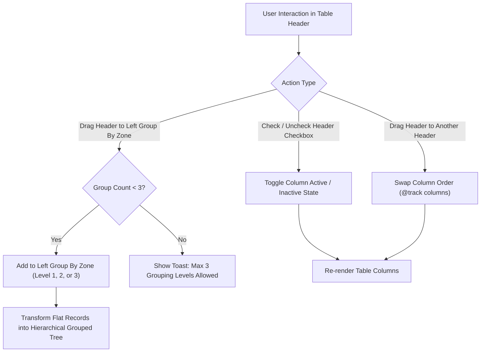
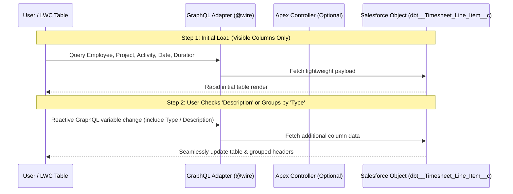

# Salesforce Report Editor–Style Dynamic LWC Table: Architectural & Implementation Plan

This plan outlines the architecture, UX patterns, and data-loading strategies for transforming the static timesheet table in [timesheetLineItemsLWC.html](file:///G:/Temp_data/SF-TimeSheet/Timesheet/main/default/lwc/timesheetLineItemsLWC/timesheetLineItemsLWC.html) into a dynamic, **Salesforce Report Editor–style table** featuring:
- **Drag-and-swap column reordering**
- **Left-side "Group By" zone (max 3 levels)**
- **In-header checkbox toggles for column activity (no separate inactive sidebar)**
- **Large-dataset threshold with sticky guidance banner**
- **Default visible columns: Employee, Project, Activity, Date, Duration only**

---

## 1. Executive Summary & Answers to Key Questions

### Q1: Can we modify Salesforce's own Report Editor and directly use it in LWC?
> **No, direct reuse or modification of Salesforce's native Report Builder is not possible.**
> Salesforce's native Report Editor (`reports:reportBuilder` and internal LWC report components) is a closed-source, proprietary internal platform component. It is not exposed in the Lightning Component Library for developer subclassing, embedding, or source modification.

**The Recommended Solution:**
We can achieve **100% visual and functional parity** by combining official **Salesforce Lightning Design System (SLDS)** UI patterns with **native LWC HTML5 Drag & Drop APIs**:
- **SLDS Builder Patterns:** Using SLDS classes such as `slds-builder_sidebar`, `slds-pill`, `slds-table_header-drop-zone`, and `slds-th__action` to render the report-builder toolbar, column pills, and drop targets.
- **Reactive Column Engine:** Using LWC reactive properties (`@track columns` and `@track activeGroups`) to dynamically drive the HTML table layout instead of hardcoded `<th>` and `<td>` tags.

---

### Q2: Are there GitHub repositories or open-source references we can learn from?

Here are the top open-source references and patterns in the Salesforce ecosystem to adapt for this architecture:

| Repository / Pattern | Key Value & Takeaways | Best Used For |
| :--- | :--- | :--- |
| **`trailheadapps/lwc-recipes`** *(Salesforce Official)* | Clean implementation of native HTML5 Drag and Drop (`ondragstart`, `ondragover`, `ondrop`) without external DOM libraries that conflict with Locker Service or Lightning Web Security (LWS). | Native Drag-and-Drop event handling in LWC. |
| **`salesforce/offline-app-developer-starter-kit`** & **Community LWC Datatable Extensions** | Demonstrates extending custom grids and tables with reactive column metadata arrays and custom header cell templates. | Building dynamic column headers and sort/order state. |
| **AG Grid LWC Integration Concepts** | Demonstrates the conceptual model of "Row Grouping by Dragging Column Headers to a Grouping Zone" (Report-style Pivot/Group By). | Understanding tree-data transformation from flat records to grouped sections. |
| **LWC Kanban Drag & Drop Patterns** *(Community repositories)* | Shows how to swap array element indices on drop and let LWC's reactive rendering engine update the DOM automatically. | Array-swap logic for column reordering. |

---

### Q3: How do we design custom Drag & Swap with "Inactive to Group By" capability?



#### A. Dynamic Column Metadata State Engine
Instead of static HTML headers, we define an array of column definitions in JavaScript:

```javascript
@track columns = [
    // Default Active (Visible) Columns
    { id: 'employee',       label: 'Employee',         fieldName: 'dbt__Employee__c',            active: true,  groupByOrder: null, order: 1 },
    { id: 'project',        label: 'Project',          fieldName: 'dbt__Project__c',             active: true,  groupByOrder: null, order: 2 },
    { id: 'activity',       label: 'Activity',         fieldName: 'dbt__Activity__c',            active: true,  groupByOrder: null, order: 3 },
    { id: 'date',           label: 'Date',             fieldName: 'dbt__Date__c',                active: true,  groupByOrder: null, order: 4 },
    { id: 'duration',       label: 'Duration',         fieldName: 'dbt__Duration__c',            active: true,  groupByOrder: null, order: 5 },
    // Default Inactive Columns (Checkbox unchecked by default)
    { id: 'type',           label: 'Type',             fieldName: 'dbt__Type__c',                active: false, groupByOrder: null, order: 6 },
    { id: 'absenceCategory',label: 'Absence Category', fieldName: 'dbt__Absence_Category__c',    active: false, groupByOrder: null, order: 7 },
    { id: 'description',    label: 'Description',      fieldName: 'dbt__Description__c',         active: false, groupByOrder: null, order: 8 }
];
```

#### B. Column Drag & Swap Mechanics
1. **Drag Start:** Each header `<th>` includes `draggable="true"` and `data-col-id={col.id}`. When dragging begins, we store the column ID in `event.dataTransfer.setData('text/plain', col.id)`.
2. **Drag Over & Highlight:** Using `ondragover` and `ondragenter`, we add an SLDS visual drop-indicator class (`slds-has-focus` or a custom border highlight) to signal where the column will land.
3. **Drop & Swap:** Upon `ondrop`, we locate the source and target indices in `@track columns`, swap their `order` properties, and re-sort the array. LWC automatically re-renders every row with the table cells in the swapped order.

#### C. In-Header Checkbox: Active / Inactive Toggle (No Separate Sidebar)
- Every table header `<th>` contains an inline `<lightning-input type="checkbox">`.
- **Checked `[x]`** = Column is active and visible. Data cells render normally.
- **Unchecked `[ ]`** = Column is inactive. The `<th>` remains visible (compact, greyed) so users can re-enable it, but the `<td>` data cells are hidden.
- **No separate "inactive" panel or sidebar is rendered** — everything is controlled directly from the column header.

#### D. Left-Side "Group By" Zone: Max 3 Levels
- A fixed left-side drop panel replaces any right/top pill bar from previous designs.
- Supports **hierarchical grouping up to 3 levels** (`groupByOrder: 1 | 2 | 3`).
- Dragging a 4th column onto the zone triggers an SLDS toast warning: *"Max 3 grouping levels allowed."*

```javascript
handleDropOnLeftGroupBy(event) {
    const colId = event.dataTransfer.getData('text/plain');
    const currentGroups = this.columns.filter(c => c.groupByOrder !== null);

    if (currentGroups.length >= 3) {
        this.showToast('Limit Reached', 'A maximum of 3 group by columns is allowed.', 'warning');
        return;
    }

    const targetCol = this.columns.find(c => c.id === colId);
    if (targetCol) {
        targetCol.groupByOrder = currentGroups.length + 1;
        this.rebuildGroupedTree();
    }
}
```

---

## 2. Data Loading Strategy: GraphQL vs. Progressive Apex

> **Recommendation:** Use **Salesforce GraphQL Wire Adapter (`lightning/uiGraphQLApi`)** for clean field selection and modern query filtering, combined with **progressive lazy loading** for hidden detail rows.



### Comparison of Data Architecture Options

| Strategy | Advantages | Trade-offs | Recommended Use Case |
| :--- | :--- | :--- | :--- |
| **Salesforce GraphQL (`lightning/uiGraphQLApi`)** | • Queries only the 5 visible columns initially, minimizing wire payload.<br>• Reactive variables allow automatic re-querying when new columns/groupings are activated.<br>• No custom Apex boilerplate for standard field reads. | • Requires LWS and UI API support for the custom object.<br>• Complex aggregations (SUM/COUNT) still require Apex. | **Primary choice** for loading visible columns and reactive column expansion. |
| **Progressive / Lazy Apex Loading** | • `getTimesheetSummary()` loads top N rows with only visible fields.<br>• Background idle call fetches hidden/inactive fields (description, type).<br>• Ideal for heavy custom aggregations or complex permission checks. | • Requires maintaining custom Apex DTO classes and manual state merging in LWC. | Best when complex server-side summary calculations or non-UI API objects are involved. |

### Large Dataset Threshold & Sticky Banner
When record count exceeds a configured threshold (`MAX_RECORDS`, e.g. `200`), the component:
1. **Truncates rendering** to the threshold limit.
2. **Shows a sticky informational banner** at the top of the table:

```html
<template if:true={isRecordCountExceeded}>
    <div class="slds-notify slds-notify_alert slds-alert_warning slds-is-sticky" role="alert">
        <lightning-icon icon-name="utility:info" size="x-small" class="slds-m-right_x-small"></lightning-icon>
        <h2>Use report for large records. (Showing first {maxRecordLimit} of {totalRecordCount} records)</h2>
    </div>
</template>
```

---

## 3. UI/UX Wireframe Layout (Left Group-By & Header Checkboxes)

```
+--------------------------------------------------------------------------------------------------------------+
| [i] STICKY: Use report for large records. (Showing 200 of 842 items)   ← only when count > MAX_RECORDS      |
+--------------------+------------------------------------------------------------------------------------------+
| GROUP BY (Left)    | [x] Employee (::) | [x] Project (::) | [x] Activity (::) | [x] Date  | [x] Duration     |
|   (Max 3 levels)   |                   |                  |   [ ] Type        |           |                  |
|                    |-------------------+------------------+-------------------+-----------+------------------|
|  1. Project    (x) |  ▼ Project: Salesforce Implementation (Total: 8.0 hrs)                                   |
|  2. Activity   (x) |      Ayan Bhunia  |  -- Grouped --   |  Development      | 2026-07-30|  4.5 hrs         |
|  [+ Drag here  ]   |      Ayan Bhunia  |  -- Grouped --   |  Code Review      | 2026-07-30|  3.5 hrs         |
|                    |  ▼ Project: Internal R&D (Total: 3.0 hrs)                                                |
|                    |      Ayan Bhunia  |  -- Grouped --   |  Documentation    | 2026-07-30|  3.0 hrs         |
+--------------------+------------------------------------------------------------------------------------------+
```

**Key Design Notes:**
- **`[x]` / `[ ]`** — Inline header checkboxes in each `<th>`. Unchecked = column hidden but header stays accessible.
- **`(::)` Drag Handle** — Grip icon in header indicates the column is draggable.
- **Group By Zone (Left)** — Shows numbered pills (`1. Project`, `2. Activity`). Max 3. Clicking `(x)` removes grouping.
- **Group Headers (`▼ Project: ...`)** — Expandable/collapsible section rows with automatic Duration subtotals.
- **Sticky Banner** — Only rendered when total record count exceeds the threshold.

---

## 4. Phased Implementation Roadmap

### Phase 1: Dynamic Column State & Reactive Renderer
1. Refactor [timesheetLineItemsLWC.html](file:///G:/Temp_data/SF-TimeSheet/Timesheet/main/default/lwc/timesheetLineItemsLWC/timesheetLineItemsLWC.html) `<thead>` from static `<th>` tags to a `for:each` loop over `@track columns`.
2. Add inline `<lightning-input type="checkbox">` in each header cell, bound to `col.active`.
3. Update `<tbody>` cell rendering to conditionally hide cell contents when `col.active === false`.
4. Restrict **default visible** columns to: `Employee`, `Project`, `Activity`, `Date`, `Duration`.

### Phase 2: HTML5 Drag & Swap Column Reordering
1. Add `draggable="true"`, `ondragstart`, `ondragover`, and `ondrop` handlers to column `<th>` elements.
2. Implement array index swapping and `order` re-sorting in `@track columns`.
3. Add SLDS visual drag-feedback styles (drop-zone border, ghost opacity).

### Phase 3: Left-Side Group By Zone (Max 3 Levels)
1. Build the left-side sticky drop panel with numbered grouping pill slots.
2. Implement `handleDropOnLeftGroupBy()` with the **Max 3 Grouping Levels** validation rule.
3. Build the client-side tree transformer that converts flat records into up to 3 nested hierarchy levels with automatic Duration subtotals.
4. Implement expand/collapse toggling on group header rows.

### Phase 4: Large Dataset Threshold & Sticky Banner
1. Configure `MAX_RECORDS = 200` (adjustable constant) in the JS controller.
2. After data load, compare `totalRecordCount` vs. `MAX_RECORDS`.
3. If exceeded: slice records to `MAX_RECORDS`, set `isRecordCountExceeded = true`, render sticky banner.

### Phase 5: GraphQL / Progressive Data Layer
1. Replace or supplement static Apex queries with `@wire(graphql)` using reactive variables tied to the active column list.
2. Implement lazy loading: initially fetch only the 5 visible fields; re-query when user activates or groups by a new column.
